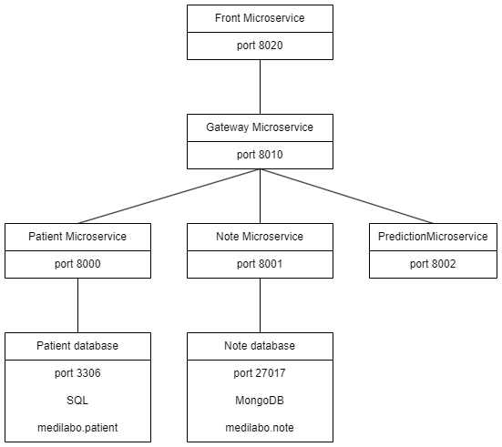

# OC_DA_JAVA_P9_Medilabo
Main repository for all medilabo services

This application allows medical professionals to handle patient information. It is designed to store identifying information of each patient, notes about a specific patient health, and can evaluate the risk for a patient to develop diabetes.

This application is made of five autonomous microservices :
- <b>front-end microservice</b> allows users to interact with the application through web pages
- <b>patient microservice</b> handles the interactions with the patient information database
- <b>note microservice</b> handles the interactions with the notes database
- <b>prediction microservice</b> takes information from the patient and note microservices and analyzes it to evaluate a patient's risk to develop diabetes
- <b>gateway microservice</b> handles the communication between microservices, including authentication and authorization

***
# GLOBAL DIAGRAM

***
# GREEN CODING
There are several ways this application can be modified to align more with the principles of green coding. This would allow the application to use less resources while maintaining the same level of performance, which would reduce its environmental impact.

### COMMUNICATION OPTIMIZATION
When the front microservice displays the list of all patients, it only needs to receive the first name, last name, and id of the patients. However, the patient microservice sends all the informations of all patients, which includes gender, address and phone number. Rewriting the patient microservice so that it returns only the relevant information would make the application more efficient.

### FRONT-END AND AUTHORIZATION
When information about a specific patient is displayed by the frond microservice, requests are sent to the note and prediction microservices, but they are only authorized for users with practioner role, which means the requests will result in 403 - forbidden and no information from theses microservices will be displayed. By sending information from the gateway to the front microservice about the roles the current user has, we would be able to stop unauthorized requests before they are sent to the gateway, which would reduce the overall amount of data transmitted.

### STORING PREDICTION RESULTS
Everytime a risk assesment is requested of the prediction microservice, it calls the patient and note microservices and runs an alogrithm before responding to the request. Instead of simply sending the result, it would be more efficient to store it so that if another call for the same patient is made in a short time period, there is no need to send requests to other microservices and run an algorithm. On top of using less processing power, this would make the application more reactive, since there would be no need to wait for the other microservices to respond and for the algorithm to run.

To make sure the risk assesment of each patient is up-to-date, it would be possible to modify the patient and note microservices so that when the relevant informations of patient are modified, or when a note for a patient is added, a request is sent to the prediction microservice to update this patient's risk assesment.
